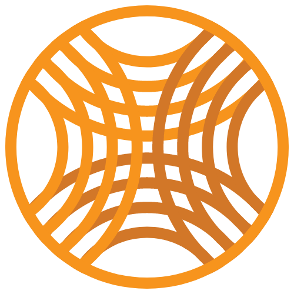

<!-- Don't delete it -->

<!-- Organization Logo -->

  

 
<!-- Organization Name -->

<!-- Organization/Project Social Handles -->

<!-- Email -->

&nbsp;&nbsp;
<!-- Telegram -->

&nbsp;&nbsp;
<!-- X (formerly Twitter) -->

&nbsp;&nbsp;
<!-- Discord -->

&nbsp;&nbsp;
<!-- Medium -->

---

 

<!-- Project core values and objective -->
<blockquote align="center">
  
&nbsp;

  <strong>
  <em style="font-size: 15px;">The Djed Alliance is the open union of all stablecoins based on the <a href="https://docs.stability.nexus/djed-stablecoin-protocols/djed-overview" style="color: #D27728">Djed Stablecoin Protocol</a>, which was researched and developed by members of <a href="https://docs.stability.nexus/about-us/the-stable-order" style="color: #D27728">The Stable Order</a>.</em>
  </strong>
  
&nbsp;

</blockquote>

 

<!-- Table of Contents -->

  
Table of Contents

  <ul>
    <li><a href="#-deploy-instructions"> ➤ Deploy Instructions</a></li>
    <li><a href="#fund"> ➤ Fund Djed Alliance</a></li>
  </ul>

<!-- Project Description Start here -->

#  DEPLOY INSTRUCTIONS

1. Install dependencies `npm install || yarn install`
2. On `main` branch run command `npm run deploy ||  yarn deploy`

<!-- Use Back Button after each section -->

<kbd><a href="#readme-top" style="color: #F7941D">↑ Back to top ↑</a></kbd>

---

<!-- Funding Badge -->

